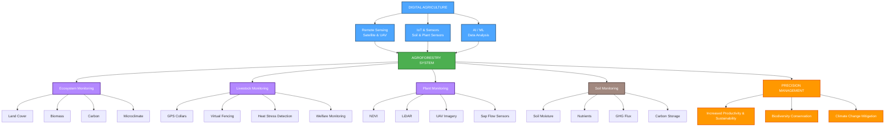

```mermaid
flowchart TB

    %% MAIN NODES
    DA[DIGITAL AGRICULTURE]
    AF[AGROFORESTRY SYSTEM]
    PM[PRECISION MANAGEMENT]

    %% DIGITAL AGRICULTURE BRANCH
    DA --> RS[Remote Sensing<br/>Satellite & UAV]
    DA --> IOT[IoT & Sensors<br/>Soil & Plant Sensors]
    DA --> AI[AI / ML<br/>Data Analysis]

    RS --> AF
    IOT --> AF
    AI --> AF

    %% AGROFORESTRY COMPONENTS
    AF --> ECO[Ecosystem Monitoring]
    AF --> LIV[Livestock Monitoring]
    AF --> PL[Plant Monitoring]
    AF --> SO[Soil Monitoring]

    %% ECOSYSTEM
    ECO --> ECO1[Land Cover]
    ECO --> ECO2[Biomass]
    ECO --> ECO3[Carbon]
    ECO --> ECO4[Microclimate]

    %% LIVESTOCK
    LIV --> LIV1[GPS Collars]
    LIV --> LIV2[Virtual Fencing]
    LIV --> LIV3[Heat Stress Detection]
    LIV --> LIV4[Welfare Monitoring]

    %% PLANT
    PL --> PL1[NDVI]
    PL --> PL2[LiDAR]
    PL --> PL3[UAV Imagery]
    PL --> PL4[Sap Flow Sensors]

    %% SOIL
    SO --> SO1[Soil Moisture]
    SO --> SO2[Nutrients]
    SO --> SO3[GHG Flux]
    SO --> SO4[Carbon Storage]

    %% OUTPUT
    AF --> PM
    PM --> OUT1[Increased Productivity & Sustainability]
    PM --> OUT2[Biodiversity Conservation]
    PM --> OUT3[Climate Change Mitigation]

    %% ======================
    %% STYLE DEFINITIONS
    %% ======================

    classDef digital fill:#4da6ff,color:#ffffff,stroke:#1f4e79,stroke-width:2px;
    classDef agro fill:#4CAF50,color:#ffffff,stroke:#1b5e20,stroke-width:2px;
    classDef monitor fill:#b388ff,color:#ffffff,stroke:#4a148c,stroke-width:2px;
    classDef soil fill:#a1887f,color:#ffffff,stroke:#3e2723,stroke-width:2px;
    classDef outcome fill:#ff9800,color:#ffffff,stroke:#e65100,stroke-width:2px;

    %% APPLY CLASSES
    class DA,RS,IOT,AI digital;
    class AF agro;
    class ECO,LIV,PL monitor;
    class SO soil;
    class PM,OUT1,OUT2,OUT3 outcome;
```
