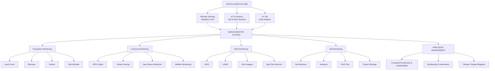

```mermaid
flowchart TB

    DA[DIGITAL AGRICULTURE]

    DA --> RS[Remote Sensing<br/>Satellite & UAV]
    DA --> IOT[IoT & Sensors<br/>Soil & Plant Sensors]
    DA --> AI[AI / ML<br/>Data Analysis]

    RS --> AF[AGROFORESTRY SYSTEM]
    IOT --> AF
    AI --> AF

    AF --> ECO[Ecosystem Monitoring]
    AF --> LIV[Livestock Monitoring]
    AF --> PL[Plant Monitoring]
    AF --> SO[Soil Monitoring]

    ECO --> ECO1[Land Cover]
    ECO --> ECO2[Biomass]
    ECO --> ECO3[Carbon]
    ECO --> ECO4[Microclimate]

    LIV --> LIV1[GPS Collars]
    LIV --> LIV2[Virtual Fencing]
    LIV --> LIV3[Heat Stress Detection]
    LIV --> LIV4[Welfare Monitoring]

    PL --> PL1[NDVI]
    PL --> PL2[LiDAR]
    PL --> PL3[UAV Imagery]
    PL --> PL4[Sap Flow Sensors]

    SO --> SO1[Soil Moisture]
    SO --> SO2[Nutrients]
    SO --> SO3[GHG Flux]
    SO --> SO4[Carbon Storage]

    AF --> PM[PRECISION MANAGEMENT]

    PM --> OUT1[Increased Productivity & Sustainability]
    PM --> OUT2[Biodiversity Conservation]
    PM --> OUT3[Climate Change Mitigation]
```
